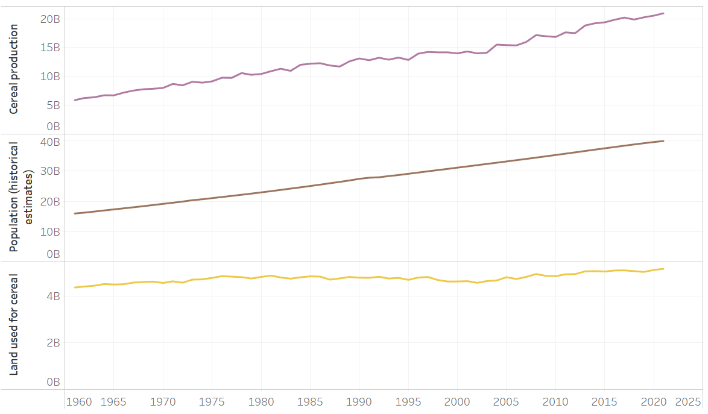
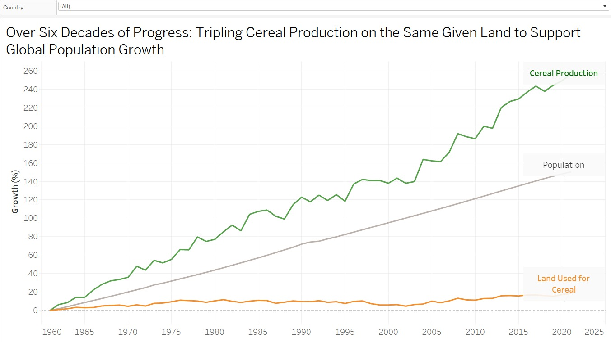

| [home page](https://asuyanto.github.io/tswd-portfolio/) | [visualizing debt](visualizing-government-debt) | [critique by design](critique-by-design) | [final project I](final-project-part-one) | [final project II](final-project-part-two) | [final project III](final-project-part-three) |

# Data Visualization from MakeoverMonday

This is the original graph that I got from MakeoverMonday. I think the graph is not perfect and need to be redesigned. I think the title is not contextual and it include too much information. I tried to redesign the graph with several steps, which sketch out my own data viz (wireframe solution), test the solution by getting feedback from readers, and recreate my data viz. I will explain those processes in more detail in the following parts.

# Solution Wireframe
This is my first sketch. The context that I want to bring here using those dataset is a great improvement in food production, specificly cereal, to supply or feed the growing population without using more agricultural land. The idea is to emphasize how awesome the agricultural improvements have gone so far by comparing the last 60 years data.
Therefore, I chose 3 graphs (cereal production, population, and land) to be displayed. The y-axis that I used is the growth in percentage since those 3 graphs have different units. I found it in my first step while making the solution, like this:

They have different units. But for contextual-wise, I chose to merged them in a graph by comparing their increment over the years, so it will give the audience perspective of how the growing population can be fed by the following food production enhancement, with the limited resources (in this case, land). To provide the growth, I aggreagated the data of each labels, as follow:

Next, for finalization, I merged them into 1 graph, I chose gray color of population data because I want to emphasize the gap between cereal production and land used. I tried to make more contextual title too, instead of giving redundant information (as the original version), as follow:

# Solution Test
## 1st test by a student, mid 20's
She found my graph title was confusing. She did not get the clear context. She could guess the story of what the graph was trying to tell, but she suggest me to make a clearer title. She thought the audience of this graph can be everyone who aware with environment and food technology.
## 2nd test by an employee, late 30's
He got the objective of the graph about success story of agricultural land intensification to increase cereal production. One thing that confusing for him was geographical scope of these data. He found out the intended audience are government, agricultural activist, or farmers. He suggested me to include the data source to clarify the claim of 'global' scope, and add the growth percentage refering to.

# Recreated Data Visualization
Throughout those suggestions, I adjusted the title to be more contextual, added growth reference (all datapoints are indexed to 1961), and added the data source below the graph, as follow:

<noscript></noscript><object class='tableauViz'  style='display:none;'><param name='host_url' value='https%3A%2F%2Fpublic.tableau.com%2F' /> <param name='embed_code_version' value='3' /> <param name='site_root' value='' /><param name='name' value='Globalcerealproduction&#47;Dashboard1' /><param name='tabs' value='no' /><param name='toolbar' value='yes' /><param name='static_image' value='https:&#47;&#47;public.tableau.com&#47;static&#47;images&#47;Gl&#47;Globalcerealproduction&#47;Dashboard1&#47;1.png' /> <param name='animate_transition' value='yes' /><param name='display_static_image' value='yes' /><param name='display_spinner' value='yes' /><param name='display_overlay' value='yes' /><param name='display_count' value='yes' /><param name='language' value='en-US' /><param name='filter' value='publish=yes' /></object>

# Summary
