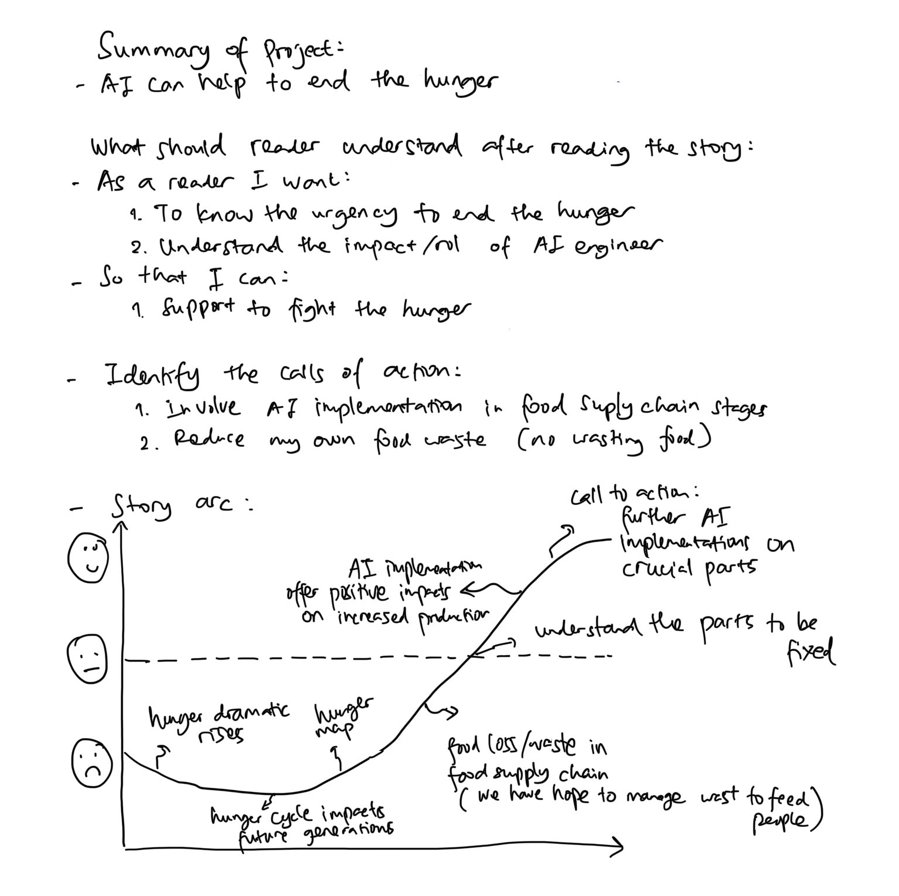
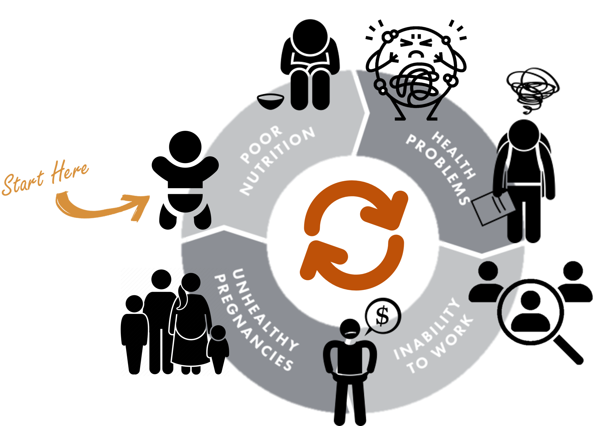

| [home page](https://asuyanto.github.io/tswd-portfolio/) | [visualizing debt](visualizing-government-debt) | [critique by design](critique-by-design) | [final project I](final-project-part-one) | [final project II](final-project-part-two) | [final project III](final-project-part-three) |

# Outline
> Include a high-level summary of your project.  This should be a couple paragraphs that describe what you're interested in showing with your final project. 

The primary objective of this project is to fight against hunger through AI implementation. Achieving zero hunger is one of the United Nations' Sustainable Development Goals, a target that requires the collaboration of all sectors. My personal interest lies in data-analytics, and I am keen to explore how it can contribute to solving this issue, specifically identifying the areas where AI can play a significant role.

> A project structure that outlines the major elements of your story.  Your Good Charts text talks about story structure in Chapter 8 - you should describe what you hope to achieve.  Make sure the outline is detailed enough that we can see how you anticipate your story unfolding.  You can incorporate your Story Arc from the in-class exercise along with your user stories and one sentence summary to make the topic even more clear. 

I will start with the background of the dramatic increase in hunger and undernourishment over the years. I aim to stress the urgency of addressing hunger by explaining the frightening cycle of hunger that could impact future generations. I also plan to show the audience the areas most affected by hunger with a heatmap that highlights these regions. In addition, I want to focus on the idea of how food loss/ waste happen in region that suffer the most from hunger, specifically looking at where the waste occurs along the food supply chain. I will then provide a broader view of food loss and waste on a global scale to identify which stages need more attention. The infographs suggest that most food loss occurs between on-farm and distribution stages. I will discuss how data analytics can optimize each stage of the food supply chain to help reduce food loss. With this, I call to use data-driven insights (AI) to decrease food losses, especially in the on-farm until distribution stages, and I will recommend the general public to cut down on our food waste during the consumption stage.

Here's my story arc:

## Initial sketches
> Post images of your anticipated data visualizations (sketches are fine). They should mimic aspects of your outline, and include elements of your story.  

<noscript></noscript><object class='tableauViz'  style='display:none;'><param name='host_url' value='https%3A%2F%2Fpublic.tableau.com%2F' /> <param name='embed_code_version' value='3' /> <param name='site_root' value='' /><param name='name' value='HungerRise&#47;Sheet2' /><param name='tabs' value='no' /><param name='toolbar' value='yes' /><param name='static_image' value='https:&#47;&#47;public.tableau.com&#47;static&#47;images&#47;Hu&#47;HungerRise&#47;Sheet2&#47;1.png' /> <param name='animate_transition' value='yes' /><param name='display_static_image' value='yes' /><param name='display_spinner' value='yes' /><param name='display_overlay' value='yes' /><param name='display_count' value='yes' /><param name='language' value='en-US' /><param name='filter' value='publish=yes' /></object>
                

Dramatic rise of hunger affects significantly to the future generations, as the Cycle of hunger:

Let's take a look the hunger map:

<noscript></noscript><object class='tableauViz'  style='display:none;'><param name='host_url' value='https%3A%2F%2Fpublic.tableau.com%2F' /> <param name='embed_code_version' value='3' /> <param name='path' value='shared&#47;Q4F8M4C4M' /> <param name='toolbar' value='yes' /><param name='static_image' value='https:&#47;&#47;public.tableau.com&#47;static&#47;images&#47;Q4&#47;Q4F8M4C4M&#47;1.png' /> <param name='animate_transition' value='yes' /><param name='display_static_image' value='yes' /><param name='display_spinner' value='yes' /><param name='display_overlay' value='yes' /><param name='display_count' value='yes' /><param name='language' value='en-US' /><param name='filter' value='publish=yes' /></object>

Up to 783 million people – one in ten of the world's population – suffer from chronic hunger. WFP estimates – from 78 of the countries where we work and where data is available – that more than 333 million people are facing acute levels of food insecurity in 2023, and do not know where their next meal is coming from. But, roughly a third of the world’s food is wasted. That’s about 1.3 billion tons a year. It is sufficient to feed > twice the number of global undernourished people!

Based on the prior hunger map, Africa suffers hunger the most and let's see further about food losses and waste along the food supply chain in Africa. Here the graph:

<noscript></noscript><object class='tableauViz'  style='display:none;'><param name='host_url' value='https%3A%2F%2Fpublic.tableau.com%2F' /> <param name='embed_code_version' value='3' /> <param name='site_root' value='' /><param name='name' value='AfricaFoodLosses&#47;Sheet1' /><param name='tabs' value='no' /><param name='toolbar' value='yes' /><param name='static_image' value='https:&#47;&#47;public.tableau.com&#47;static&#47;images&#47;Af&#47;AfricaFoodLosses&#47;Sheet1&#47;1.png' /> <param name='animate_transition' value='yes' /><param name='display_static_image' value='yes' /><param name='display_spinner' value='yes' /><param name='display_overlay' value='yes' /><param name='display_count' value='yes' /><param name='language' value='en-US' /><param name='filter' value='publish=yes' /></object>
                

Food losses and waste in Africa happen the most at on-farm until distribution stages. 
Whereas, globally, 13 percent of food produced is lost between harvest and retail, while an estimated 17 percent of total global food production is wasted in households, in the food service and in retail (UN, 2023)

We can understand that most food losses and waste happen between on-farm and distribution. AI can help through:
1. AI-based advisory increased 30% crop production
2. Streamlined inventory management
3. Proactive stock rotation
4. Product shelf-life monitoring

# The data
> A couple of paragraphs that document your data source(s), and an explanation of how you plan on using your data.

I start with the increased hunger trends data from "Hunger & Undernourishment Data". Next, I created hunger cycle diagram by following "Hunger Cycle" references. I hope the audience get the urgency to stop the hunger cycle and fight hunger together. Then, I show the hunger map, how the hungers distributes across countries, by using "Hunger & Undernourishment Data" dataset in a different typograph. To give a deeper understanding, I provide the number of global hunger from 'A Global Hunger Crisis' reference and contradict the data with the number of food wasted from  'Wasted Leftovers' reference.
Moving forward, I will drag the audience focus to the region that suffers hunger the most, which is Africa. Next, we also analyze the food losses/ waste on that region from 'Africa's Food Losses Across Value Chain' reference. Furthermore, to emphasize on which food value chain should be maintained in general, I refer to 'Food Losses & Waste' data.
A good news come up. The crucial value chain stages can be solved by AI. There is a success story of 'AI Implementation in Agriculture'. Furthermore, I provide another opportunities for AI to take actions on these parts that coming from Reducing 'Food Losses & Waste Through Data-Driven Insights' reference. I hope those opportunities and success story inspire Data Scientist and ML engineers to involve in fighting this hunger.

> A link to the publicly-accessible datasets you plan on using, or a link to a copy of the data you've uploaded to your Github repository, Box account or other publicly-accessible location. Using a datasource that is already publicly accessible is highly encouraged.  If you anticipate using a data source other than something that would be publicly available please talk to me first. 

| Name | URL | Description |
|------|-----|-------------|
|  Hunger & Undernourishment Data | https://ourworldindata.org/hunger-and-undernourishment  | Global hunger data in prevalence units  |
|  Hunger Cycle | https://www.mercycorps.org/blog/facts-global-hunger#:~:text=Hunger%20is%20a%20perilous%20cycle,or%20to%20improve%20their%20lives. | A reference of hunger cycle |
| A Global Hunger Crisis | https://www.wfp.org/stories/wfp-glance#:~:text=Up%20to%20783%20million%20people,next%20meal%20is%20coming%20from. | The number of hungers instead of prevalence |
| Wasted Leftovers | https://www.theworldcounts.com/challenges/people-and-poverty/hunger-and-obesity/food-waste-statistics | The number of food waste refrence|
| Africa's Food Losses Across Value Chain | https://unctad.org/system/files/official-document/dtlstict2017d5_en.pdf | Africa food losses distrubution across food value chain |
|   Food Losses & Waste   |  https://www.un.org/en/observances/end-food-waste-day |  Global data of food losses |
| AI implementation in Agriculture | https://www.sciencedirect.com/science/article/pii/S258972172030012X#s0125 | The success story of AI implementation in agriculture (boost crops production)|
|  Reducing Food Losses & Waste Through Data-Driven Insights  |   https://www.grocerydive.com/spons/leveraging-data-analytics-for-enhanced-food-traceability-and-waste-reductio/692938/#:~:text=Reducing%20Food%20Waste%20Through%20Data,shelf%20life%20and%20managing%20inventory.  | How data science has a crucial role in food supply chain |

# Method and medium
> In a few sentences, you should document how you plan on completing your final project. 

I am going to use Tableau and Shorthand for this project deliverables.
